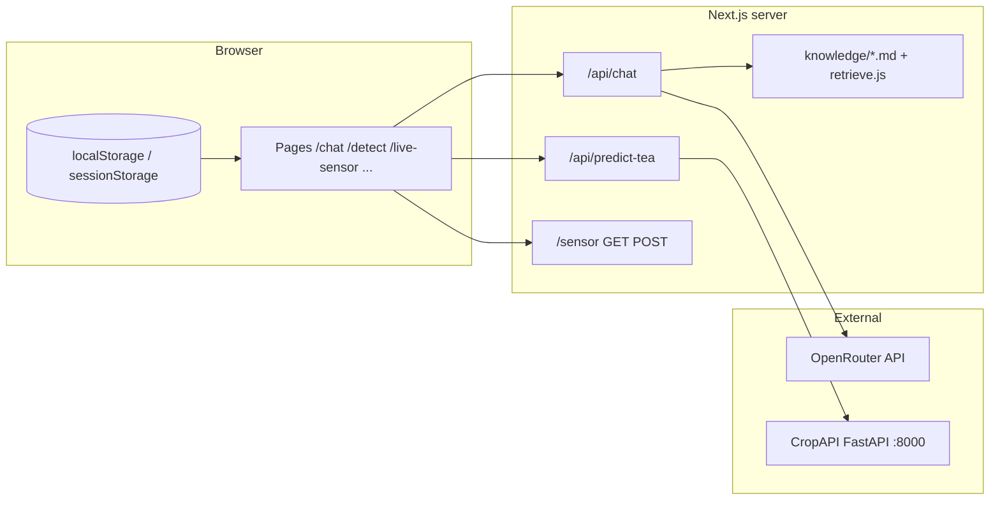

# CropAIplus — current project overview

CropAIplus is a **Next.js 15** (App Router) web app for farmers: **multilingual UI**, **disease detection** (via an optional Python **CropAPI**), **live sensor** polling, **farm profile**, and **AgriBot** chat. The assistant is powered by **OpenRouter** on the **server only**; the browser talks to **`POST /api/chat`** and never sees the API key.

This README describes the **current architecture** and how to run it. For a **friend-focused diff** vs an older baseline (especially the **knowledge / memory** stack), see **`FRIEND_CHANGES.md`**. A shorter historical bullet list is in **`CHANGES.md`**.

---

## Architecture at a glance



- **AgriBot:** `app/chat/page.js` streams the reply from **`/api/chat`**, sending `messages` and optional **`caseContext`**, **`farmProfile`**, **`sensorContext`**.
- **Knowledge layer:** On each request, `lib/knowledge/retrieve.js` reads **`knowledge/`**, scores pages (keywords + optional context hints), and injects a bounded markdown excerpt + **`Sources used: …`** into the system prompt (`lib/agribot-prompt.js`). No vector database.
- **Disease detection:** The client posts to **`/api/predict-tea`**, which proxies to **`ML_API_URL`** (default `http://127.0.0.1:8000`).
- **Sensors:** Devices **`POST /sensor`**; the UI polls **`GET /sensor`**. Data is held **in memory** on the Node process (resets on server restart).

---

## Requirements

| Tool | Purpose |
|------|---------|
| **Node.js** (LTS, e.g. 20.x or 22.x) | Next.js app |
| **Python 3.10+** | Optional — CropAPI only |
| **Git** | Optional |

---

## Quick start (frontend)

```bash
cd CropAIplus
npm install
cp .env.example .env.local
# Edit .env.local — at minimum set OPENROUTER_API_KEY for chat
npm run dev
```

Open **http://localhost:3000**.

If the tab shows a blank page but the server returns 200, stale webpack cache is likely:

```bash
npm run dev:clean
```

That runs **`rm -rf .next`** then **`next dev`**. Do not delete **`.next`** while `next dev` is still running.

---

## Environment variables

Copy **`.env.example`** → **`.env.local`** in the project root (next to `package.json`).

| Variable | Required | Role |
|----------|----------|------|
| **`OPENROUTER_API_KEY`** | For AgriBot | Server-side chat completions via OpenRouter. |
| **`OPENROUTER_MODEL`** | No | Overrides default model id (see `.env.example`). |
| **`OPENROUTER_SITE_URL`** | No | Referer header for OpenRouter. |
| **`ML_API_URL`** | No | CropAPI base URL; `next.config.mjs` also exposes **`NEXT_PUBLIC_ML_API_URL`** for the detect page. |
| **`NEXT_PUBLIC_FIREBASE_*`** | No | Client Firebase config (`lib/firebase.js`); falls back to built-in placeholders if unset. |
| **`SENSOR_INGEST_SECRET`** | No | If set, **`POST /sensor`** requires **`Authorization: Bearer <secret>`**. |

Restart **`npm run dev`** after editing **`.env.local`**.

---

## Optional: CropAPI (disease detection)

Used by **`/detect`**. From the **`CropAPI/`** folder (see that directory’s `app.py` and model files):

```bash
python -m venv .venv
source .venv/bin/activate   # Windows: .venv\Scripts\activate
pip install fastapi uvicorn python-multipart pillow numpy pandas tensorflow
uvicorn app:app --host 0.0.0.0 --port 8000
```

If CropAPI is down, the UI should show an unreachable / 503-style error when analyzing an image.

---

## Ports

| Service | Port |
|---------|------|
| Next.js (`npm run dev`) | **3000** |
| CropAPI | **8000** |

---

## Main routes and features

| Path | Description |
|------|-------------|
| **`/`** | Landing |
| **`/chat`** | AgriBot; streams from **`/api/chat`**; optional handoffs from detect / farm / sensors |
| **`/detect`** | Image upload / camera → **`/api/predict-tea`** → CropAPI |
| **`/farm-profile`** | Farm context saved in **`localStorage`**; sent as **`farmProfile`** to chat |
| **`/live-sensor`** | Polls **`GET /sensor`**; can push **`sensorContext`** and open chat |
| **`/sensor`** | **`GET`** latest reading (404 if empty); **`POST`** ingest (see `.env.example` for auth) |
| **`/auth/login`**, **`/auth/signup`** | Firebase-backed auth flows |
| **`/marketplace/**`** | Marketplace UI (cart, checkout, payment pages) |

**Internationalization:** English, Hindi, Tamil — **`contexts/LanguageContext.tsx`** (+ shim **`LanguageContext.js`**), **`lib/locales/*`**, navbar language switcher.

---

## Knowledge pack (curated “memory” for the LLM)

- **Edit content:** `knowledge/index.md`, `knowledge/pages/*.md`, optional YAML front-matter (`crops`, `topics`, `risk`).
- **Versioning:** `knowledge/manifest.json` (pack id, version, effective date).
- **Logic:** `lib/knowledge/retrieve.js`, `frontMatter.js`, `manifest.js`.

Behavior is documented in **`KNOWLEDGE_INTEGRATION_PLAN.md`** and **`KNOWLEDGE_LAYER_ENHANCEMENT_PLAN.md`**. Step-by-step tests for your teammate are in **`FRIEND_CHANGES.md`**.

---

## Browser-side “memory” (not the wiki)

- **`lib/chatStorage.js`** — Persists chat messages in **`localStorage`**.
- **`lib/farmProfile.js`** — Farm profile blob + update event.
- **`lib/detectCase.js`** — Session disease case after detection.
- **`lib/sensorContext.js`** — Sensor snapshot passed into chat when coming from live sensors.

---

## Scripts (`package.json`)

| Script | Command |
|--------|---------|
| **`npm run dev`** | Development server |
| **`npm run dev:clean`** | `rm -rf .next` then `next dev` |
| **`npm run clean`** | Remove **`.next`** only |
| **`npm run build`** | Production build |
| **`npm run start`** | Serve production build |
| **`npm run push:github`** | Helper push script (if configured) |

---

## Troubleshooting

| Symptom | What to try |
|---------|-------------|
| Chat 503 / “misconfiguration” | Set **`OPENROUTER_API_KEY`** in **`.env.local`**. |
| Chat 402 / 429 | OpenRouter billing or rate limits — credits, wait, or **`OPENROUTER_MODEL`**. |
| Detect fails / 503 | Start CropAPI; check **`ML_API_URL`**. |
| Blank UI, **`/_next/static/*` 404** | **`npm run dev:clean`**; avoid deleting **`.next`** while dev is running. |
| **`next` / `tsc` permission denied** | `chmod +x node_modules/.bin/next` or run via `node node_modules/next/dist/bin/next …` |
| TensorFlow / Python issues | Use a CPU wheel matching your OS/arch (see CropAPI docs). |

---

## Security

- Do **not** commit **`.env.local`**, API keys, or Firebase secrets.
- Share **`.env.example`** only as a template.
- If **`SENSOR_INGEST_SECRET`** is set, treat it like a password and configure the ESP32 with the same Bearer token.

---

## Repository layout (high level)

- **`app/`** — Pages, layouts, **`api/chat`**, **`api/predict-tea`**, **`sensor`**
- **`components/`**, **`contexts/`** — UI and providers
- **`lib/`** — Firebase, i18n, chat/sensor/detect storage, **`lib/knowledge/`**, **`lib/logger.js`**, prompts
- **`knowledge/`** — Curated markdown + **`manifest.json`**
- **`CropAPI/`** — FastAPI tea disease service
- **`cropai-knowledge-base/`** — Separate experimental wiki app (not required to run main CropAIplus)

---

## Pushing to GitHub

If remote **`abhinav`** (or similar) is configured:

```bash
chmod +x scripts/push-to-abhinav.sh   # once
npm run push:github
```

Use a **PAT** (HTTPS) or **SSH** as documented in your Git hosting settings. See previous README notes for `git remote set-url` if switching to SSH.

---

## Further reading

- **`FRIEND_CHANGES.md`** — What changed vs the original fork (emphasis on knowledge + memory) + **testing checklist** for a teammate.
- **`CHANGES.md`** — Compact changelog bullets.
- **`KNOWLEDGE_INTEGRATION_PLAN.md`**, **`KNOWLEDGE_LAYER_ENHANCEMENT_PLAN.md`** — Design decisions for the wiki layer.
